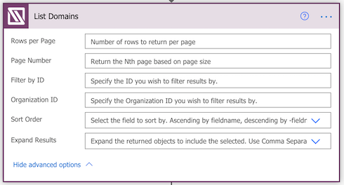

ACTION
<h1> List Domains</h1>

 

<h3>Description</h3>

Returns a list of domains for all organizations or for a specified organization.

<h3>Important Parameters</h3>

None.

<h3>Advanced Parameters</h3>

| Parameter Name | Description | Required | Acceptable Values |
|-|-|-|-|
| Rows per Page | Number of data rows to return per page. Default of 50. Max of 1000. For more details on how to perform data paging in Power Automate with IT Glue, see page on data paging.| No | Integer |
| Page Number | The page number to return based on the page size set in Rows per Page. | No | Integer |
| Filter by ID | Return a single domain by filtering the list view by the DOmain's ID | No | Integer |
| Organization ID | Filter the dataset to include only domains for the specified Organization's ID  | No | Integer |
| Sort Order | Field by which to sort the results. | No | fieldName for ascending sort, -fieldName for descending sort (e.g. name or -name) | 
| Expand Results | Expand the returned data set to Include additional related data in the Included Object. | No | Blank or any of passwords, attachments, user_resource_accesses, group_resources_accesses |

> NOTE API Documentation specifies the **Sort Order** parameter is available, but in practice, sending a sort parameter with any value is ignored and the list is returned in the same order.

<h3>Additional References</h3>

- [IT Glue Developer Documentation for the GET /domains API Endpoint](http://api.itglue.com/developer#domains-index)
